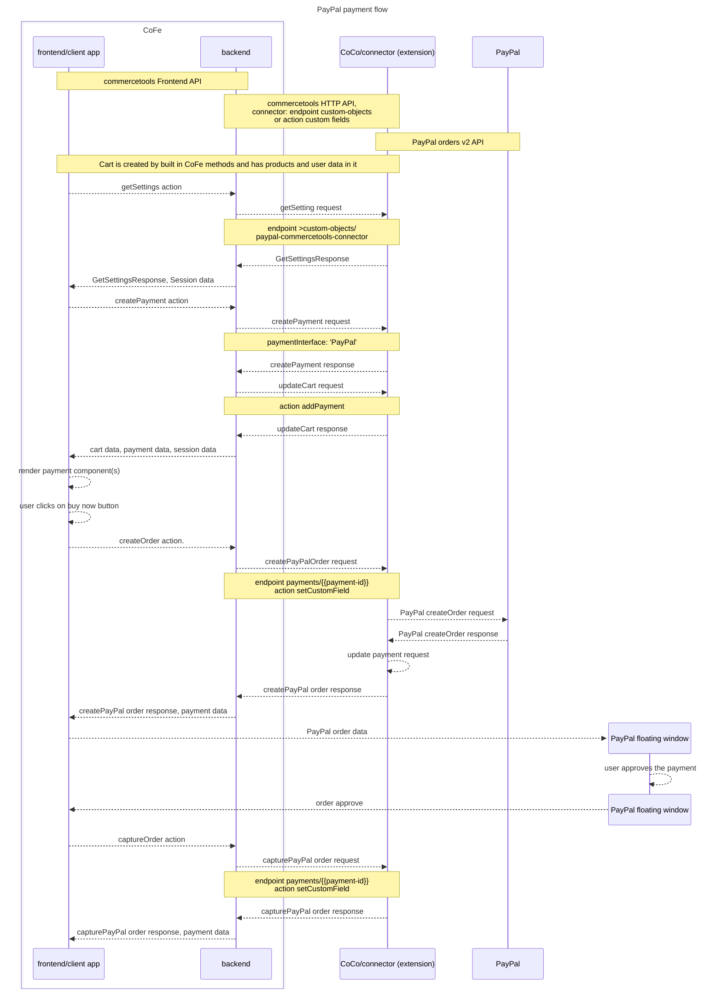

Here we present a simplified sequence diagram for payment process with PayPal buy now payment. For full detailed process please refer to [Architecture.pdf](../Architecture.pdf).

In this diagram we focus on the interaction with the PayPal commercetools connector and PayPal client app required to complete the payment. 

The communication between commercetools frontend (CoFe) and commercetools HTTP API (CoCo) that is not related directly to the payment with PayPal is not explained in this diagram. In brief CoFe has built in routines to update the cart and the payment whenever they might have being changed.

The official documentation for the API mentioned it the diagram can be found at [commercetools Frontend API's](https://docs.commercetools.com/frontend-api/action), [commercetools HTTP API](https://docs.commercetools.com/http-api), and [PayPal orders v2 API](https://developer.paypal.com/docs/api/orders/v2/).

